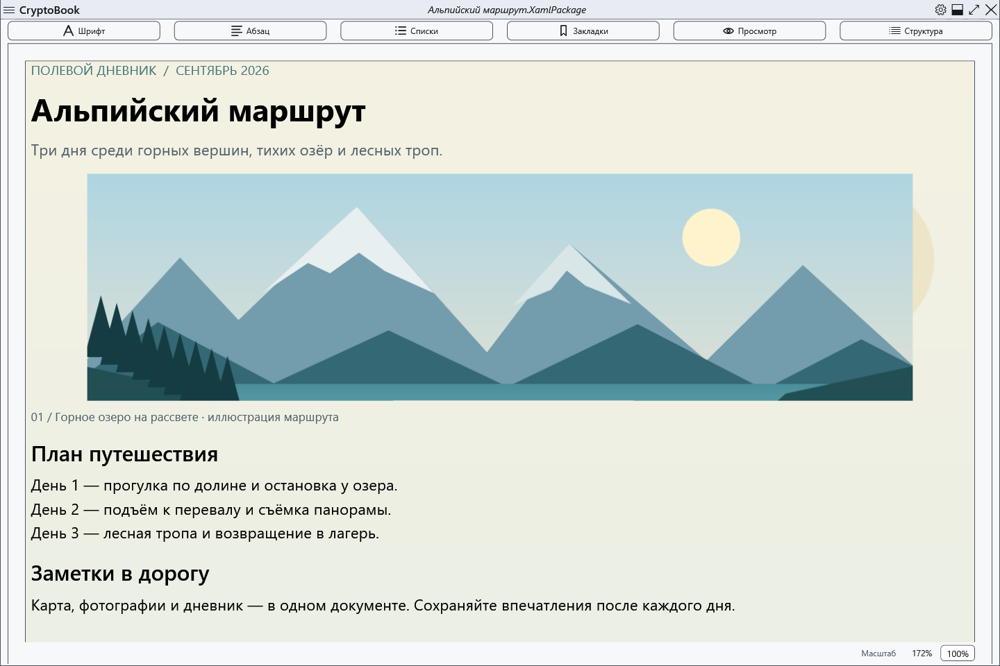
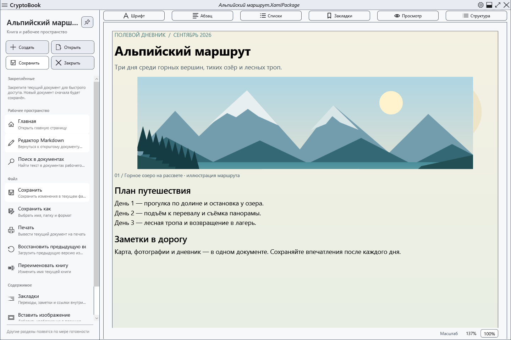
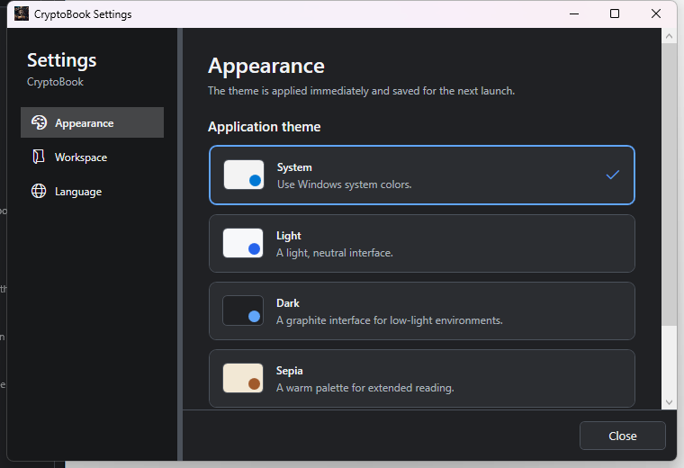
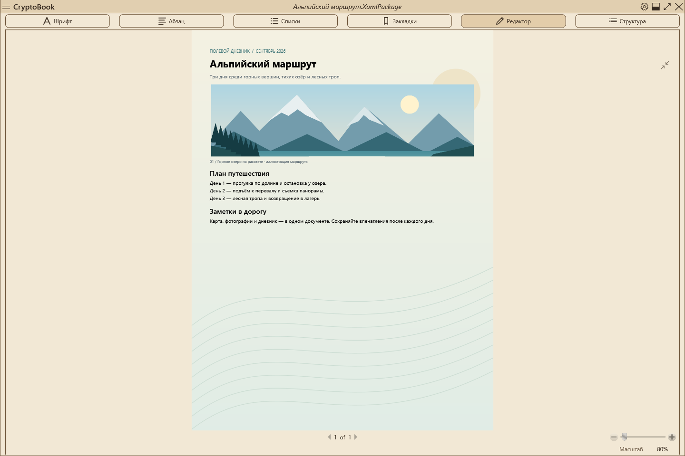

# CryptoBook

[Русский](README.ru.md)

[](https://github.com/RomanovCopy/CryptoBook/actions/workflows/ci.yml)
[](https://github.com/RomanovCopy/CryptoBook/releases/tag/v1.1.2.51)
[](https://dotnet.microsoft.com/download/dotnet/10.0)
[](https://www.microsoft.com/windows)
[](LICENSE)

**A local-first encrypted document workspace for Windows.**

CryptoBook combines rich-text editing, local file management, full-text search, media preview,
and password-protected documents in one WPF desktop application. Documents stay on your
machine unless you explicitly move or share them.

[](https://github.com/RomanovCopy/CryptoBook/releases/latest)

> CryptoBook is under active development. Keep independent backups of important data.
> Current Windows binaries may be distributed without Authenticode signing; release assets
> include SHA-256 checksums and an explicit signing-status file.



## Why CryptoBook?

- **Local-first workflow** — documents and application state are stored locally.
- **Encrypted documents** — `.cbook` files use password-derived authenticated encryption.
- **Rich-text editing** — formatting, lists, links, images, bookmarks and printing.
- **File workspace** — browsing, favorites, Quick Access, sorting and clipboard operations.
- **Search** — file-name and full-text search, including supported encrypted documents.
- **Recovery** — crash recovery, `.bak` backups and atomic file replacement.
- **Media preview** — text, images and video playback through Flyleaf/FFmpeg.
- **Windows integration** — system dialogs, themes and self-contained x64 releases.

## Screenshots

| File workspace | Themes |
| --- | --- |
|  |  |
| **Sepia reading mode** | **Editor** |
|  |  |

## Main features

- create and edit TXT, RTF, XAML and XamlPackage documents;
- format text and paragraphs, create lists, insert links and images;
- resize and position images inside documents;
- browse folders and files with sorting, favorites and change monitoring;
- pin frequently used documents with Quick Access;
- search file names inside the selected workspace;
- perform full-text search across supported documents, including `.cbook` files after unlock;
- preview text and images and play video through Flyleaf/FFmpeg;
- use bookmarks and document navigation;
- print the current document through the Windows print dialog;
- choose system, light, dark and Sepia themes;
- encrypt individual files and directories;
- automatically clear the in-memory encryption key after a configurable idle period;
- recover unsaved document state after a crash;
- save atomically and keep the previous version as a `.bak` file;
- check GitHub for stable releases and launch downloaded installers.

## Supported formats

| Purpose | Formats |
| --- | --- |
| Editable documents | `.txt`, `.log`, `.md`, `.cs`, `.json`, `.xml`, `.rtf`, `.xaml`, `.XamlPackage` |
| Images | `.png`, `.jpg`, `.jpeg`, `.bmp`, `.gif`, `.webp` |
| Video | `.mp4`, `.mkv`, `.avi`, `.mov`, `.webm`, `.wmv` and other Flyleaf/FFmpeg-supported containers |
| Protected files | `.cbook`, legacy `.cbox` |
| External opening | `.pdf` |

PDF files are opened by the system application and are not edited inside CryptoBook.
Video-codec support depends on the bundled media engine.

## Security overview

The current `.cbook` format uses:

- Argon2id for password-based 256-bit key derivation;
- AES-256-GCM for authenticated encryption;
- random salts and nonces;
- atomic file replacement after successful operations.

The encryption key is kept in process memory only for the active session and can be cleared
automatically after inactivity. Recovery snapshots use Windows DPAPI for the current user.
Legacy `.cbox` files remain readable for backward compatibility.

Encryption reduces the risk of reading a protected file without its password, but it is not a
backup mechanism. A lost password cannot be recovered.

For vulnerability reporting and the supported security scope, see [SECURITY.md](SECURITY.md).

## System requirements

For official builds:

- Windows 10 version 1809 or later;
- 64-bit Windows.

The installer is self-contained and does not require a separate .NET Desktop Runtime install.

## Download and run

For most users, download the installer from the
[latest release](https://github.com/RomanovCopy/CryptoBook/releases/latest).
A portable `win-x64` ZIP is also published with release assets.

Release assets include SHA-256 checksums, SPDX SBOM data and signing-status information.
See [CHANGELOG.md](CHANGELOG.md) for release highlights.

## Build from source

Development requires the .NET 10 SDK (10.0.400 or newer in the 10.0 feature
band). Visual Studio users should install the
**.NET desktop development** workload.

```powershell
git clone https://github.com/RomanovCopy/CryptoBook.git
cd CryptoBook
dotnet restore CryptoBook/CryptoBook.sln --locked-mode
dotnet build CryptoBook/CryptoBook.sln -c Release --no-restore
dotnet test CryptoBook/CryptoBook.sln -c Release --no-restore

# Self-contained single-file x64-публикация и установочный EXE (требуется Inno Setup 6)
./installer/Build-Installer.ps1 -Version 1.1.2.51
```

To build a self-contained x64 package and installer, install Inno Setup 6 and run:

```powershell
./installer/Build-Installer.ps1 -Version 1.2.3
```

The project uses xUnit and STA tests for WPF. Compiler warnings and detected NuGet
vulnerabilities are treated as errors in the release workflow.

## Project structure

```text
CryptoBook/
├── CryptoBook/          # WPF application
│   ├── Views/
│   ├── ViewModels/
│   ├── Models/
│   ├── Services/
│   ├── Security/
│   ├── FileTemplates/
│   └── Themes/
├── CryptoBook.Tests/    # unit and WPF STA tests
├── CryptoBook.Performance/
├── docs/
├── installer/
├── compliance/
└── .github/workflows/   # CI and release automation
```

CryptoBook is built with WPF and .NET 10, follows MVVM, and uses Autofac for dependency
injection.

## CI and releases

GitHub Actions restores locked dependencies, runs Release tests and builds the Windows x64
installer. Production releases are created from tags such as `v1.2.3` or `v1.2.3.4` and include
an installer, portable ZIP, SHA-256 checksums, an SPDX SBOM and signing status.

Operational release details are documented in [docs/PRODUCTION.md](docs/PRODUCTION.md).

## Contributing

Contributions are welcome. See [CONTRIBUTING.md](CONTRIBUTING.md) for the build, test and PR
workflow. Changes to cryptography, recovery or release automation require extra review.

## License and third-party notices

CryptoBook is licensed under [GNU GPL version 3 only](LICENSE) (`GPL-3.0-only`).
Copyright information is in [COPYRIGHT.md](COPYRIGHT.md), third-party notices are in
[THIRD_PARTY_NOTICES.md](THIRD_PARTY_NOTICES.md), and corresponding-source information is in
[SOURCE_CODE.md](SOURCE_CODE.md).

Asset provenance is documented in [ASSET_PROVENANCE.md](ASSET_PROVENANCE.md). FFmpeg provenance,
build parameters and pinned source references are documented in
[`compliance/ffmpeg/PROVENANCE.md`](compliance/ffmpeg/PROVENANCE.md).
