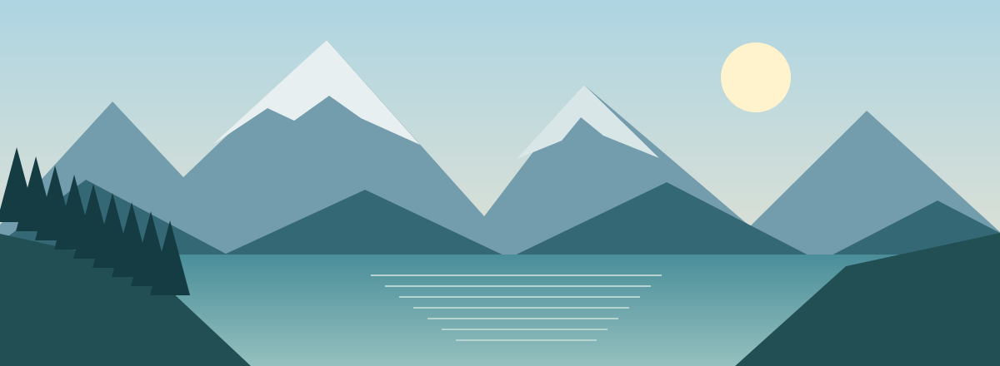

# Альпийский маршрут

**Полевой дневник · сентябрь 2026**

## План путешествия

| День | Маршрут | Расстояние |
| --- | --- | --- |
| 01 | Долина и озеро | 8 км |
| 02 | Тропа к перевалу | 12 км |
| 03 | Панорамный маршрут | 6 км |

> Сохраните карту и заметки локально — они будут под рукой без интернета.

### Что взять с собой

- Камеру и запасной аккумулятор
- Карту маршрута и полевой дневник
- Термос, дождевик и удобную обувь